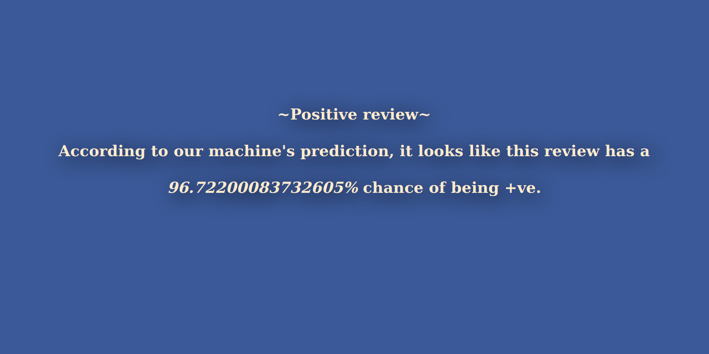

# Movie-review-prediction-ML-project-
Project uses neural network in order to extract out sentiments from a given movie review and tell whether it is a +ve review or a -ve one. It uses flask module for data transformation between front-end and back-end.

# Screenshots : 
1. Entering movie review and submitting : 

    (Let machine do it's prediction....)

2. Results :

    (And that's all.)
    
# Modules :
1. Tensorflow for model training and neural network.
2. Flask for web-app.
3. NumPy for data-cleaning.
